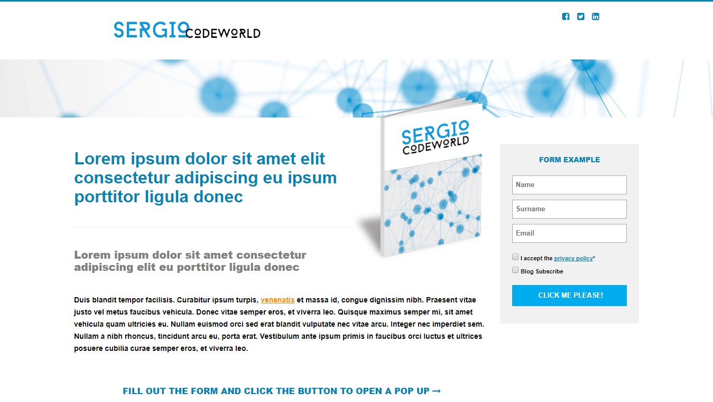
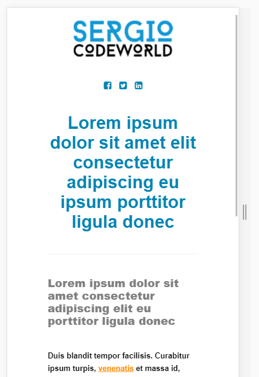

# Responsive Web Design (RWD)

This repository contains a simple **RWD** in one page. I just used `HTML`, `CSS` and `JavaScript` to write the code. 

No `bootstrap` nor other frameworks.

I used *media queries* to change properties by width.

#### The next image is a full width preview of the web:

#### This image is a mobile preview

